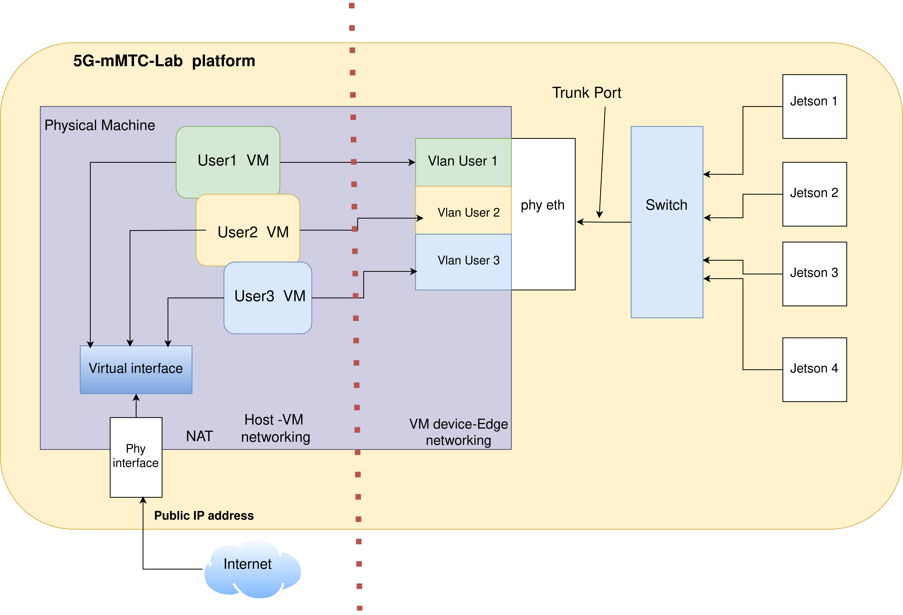

# This Git-Hub project is part of the testbed developed in the context of the project 5G-mMTC (and NGC-AIoT).

The testbed itself includes several components, the "system-manager" is in charge of everything low-level which is 
specific to the hardware/networks and exports it through API for other components.

Initially, the focus is on managing a testbed of Jetson devices (Xavier and Nano).
Due to network/NFS boot issues on some Jetsons, and also for maximal manageability, the testbed is designed to work as
follows:
- each Jetson will have it root filesystem through NFS (itself in a VM or container)
- each Jetson is expected to be powered through PoE (in order to reboot)
- each Jetson is put in recovery mode (physical), to have full control of the booting/reinstall process



## The `system-manager`

The system-manager provides an API for the user to manage all the hardware and software components of the testbed.
- It provides a Python API, through the `api/system_manager_api.py`. 
- This API can also be exported as a REST API service through `api/system_manager_service.py`

### Getting started

It is designed to be used as part of a large platform (with other components), and thus repackaged.
The steps below are only to run the `system-manager` standalone.

You can install and configure the **`system-manager`** either **manually** or **using an Ansible playbook**.


#### **1.a Manual Installation**

To install the **system-manager** manually, follow these steps:

1. **Install LXD:**
   ```bash
   sudo snap install lxd --channel=latest/stable
   ```

2. **Install Python Dependencies:**
   ```bash
   pip install fastapi
   pip install pandas 
   pip install pylxd 
   pip install netmiko
   pip install uvicorn
   ```

3. **Download the Rootfs and BSP for Jetson flashing into the `data` folder:**
   ```bash
   cd system-manager/data
   ```

   - **BSP:**
     ```bash
     wget https://developer.nvidia.com/downloads/embedded/l4t/r35_release_v4.1/release/jetson_linux_r35.4.1_aarch64.tbz2
     ```

   - **Rootfs:**
     ```bash
     wget https://developer.nvidia.com/downloads/embedded/l4t/r35_release_v4.1/release/tegra_linux_sample-root-filesystem_r35.4.1_aarch64.tbz2
     ```

4. **LXD Initialization (done once only):**
   ```bash
   lxd init --minimal
   ```


#### **1.b Installation Using Ansible Playbook**

To automate the installation and configuration of the **system-manager**, use the **Ansible playbook**. This will configure all necessary components, including LXD group permissions, LXD service restarts, and Python dependencies.
0. **install ansible :**
  sudo apt install ansible 

1. **Set the MAC Address for Jetson Network Interface:**

   Before launching Ansible, you need to set the MAC address of the network interface that will be used to connect the **system-manager** to the switch. This can be done in the `ansible/roles/server/vars/main.yml` file. Update the `mac_address` field accordingly.

2. **Run the Ansible Playbook:**
   ```bash
   cd ansible && ansible-playbook -i inventory.ini playbooks/site.yml --ask-become-pass
   ```

3. **Reboot the System:**

   After running the playbook and configuring the necessary components, a **system reboot** is required to apply all changes effectively.


### **2. Switch Configuration Before Running the System Manager API**

Before running the **system-manager API**, ensure that the switch is properly configured. This involves setting up the network connections between the Jetson devices and the switch. For detailed steps on how to configure the switch, please refer to the instructions in the [docs/switch-config.md](docs/switch-config.md) file.

---
### **3. Matching Jetson Devices with Switch Interfaces**

To properly match each Jetson device with its corresponding switch interface, you will need to manually map the devices. This is necessary to ensure proper network connectivity between the Jetsons and the switch.

Use the `get_xavier_instances()` function from the [jetson_ctl.py](scripts/jetson_ctl.py) script to help detect and identify each Jetson device. This function will assist in detecting Jetson devices one by one, enabling you to make the correct mapping between each Jetson and its corresponding switch interface.

---

### **4. Running the System Manager API**

Once the **system-manager** is installed and properly configured (either manually or via Ansible), you can run the **API** as follows:

1. **Navigate to the `api` directory:**
   ```bash
   cd api
   ```

2. **Start the system manager API service:**
   ```bash
   python3 system_manager_service.py
   ```

The **system-manager** API will now be running, and you can interact with it via the API endpoints provided in `system_manager_api.py` or through the exported REST API service.


---

### **Docker and LXD Compatibility**

If **Docker** is installed alongside **LXD**, you may encounter networking issues. To resolve this, ensure you add the following iptables rules:

1. **Allow communication from Docker to LXD network:**
   ```bash
   iptables -I DOCKER-USER -i lxdbr0 -j ACCEPT
   ```
   
2. **Allow communication from LXD network to Docker:**
   ```bash
   iptables -I DOCKER-USER -o lxdbr0 -m conntrack --ctstate RELATED,ESTABLISHED -j ACCEPT
   ```

Additionally, if **Docker** is running, stop it to avoid conflicts with **LXD**:

```bash
sudo systemctl stop docker
```

---