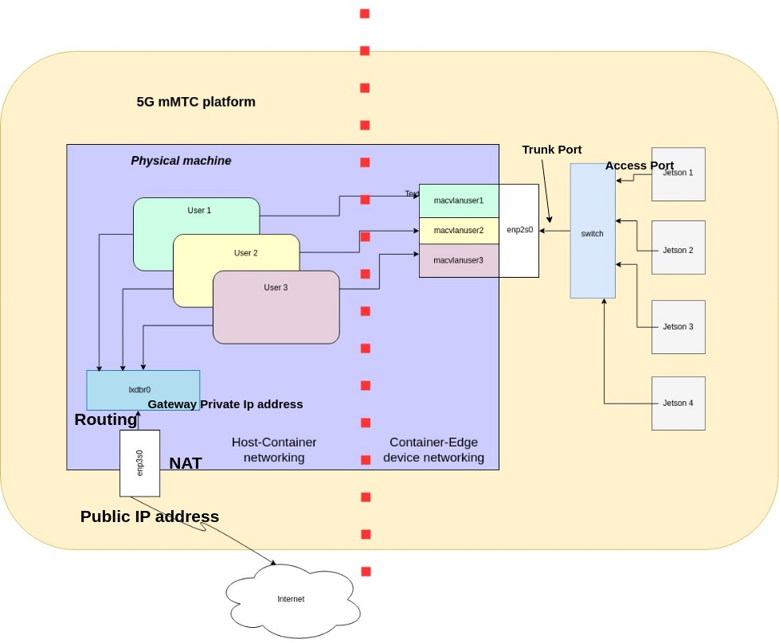

# This Git-Hub project is part of the testbed developed in the context of the project 5G-mMTC (and NGC-AIoT).

The testbed itself includes several components, the "system-manager" is in charge of everything low-level which is 
specific to the hardware/networks and exports it through API for other components.

Initially, the focus is on managing a testbed of Jetson devices (Xavier and Nano).
Due to network/NFS boot issues on some Jetsons, and also for maximal manageability, the testbed is designed to work as
follows:
- each Jetson will have it root filesystem through NFS (itself in a VM or container)
- each Jetson is expected to be powered through PoE (in order to reboot)
- each Jetson is put in recovery mode (physical), to have full control of the booting/reinstall process



## The `system-manager`

The system-manager provides an API for the user to manage all the hardware and software components of the testbed.
- It provides a Python API, through the `api/system_manager_api.py`. 
- This API can also be exported as a REST API service through `api/system_manager_service.py`

### Getting started

It is designed to be used as part of a large platform (with other components), and thus repackaged.
The steps below are only to run the `system-manager` standalone.

You can install and configure the **`system-manager`** either **manually** or **using an Ansible playbook**.


#### **1. Manual Installation**

To install the **system-manager** manually, follow these steps:

1. **Install LXD:**
   ```bash
   sudo snap install lxd --channel=latest/stable
   ```

2. **Install Python Dependencies:**
   ```bash
   pip install fastapi
   pip install pandas 
   pip install pylxd 
   pip install netmiko
   ```

3. **Download the Rootfs and BSP for Jetson flashing into the `data` folder:**
   ```bash
   cd system-manager/data
   ```

   - **BSP:**
     ```bash
     wget https://developer.nvidia.com/downloads/embedded/l4t/r35_release_v4.1/release/jetson_linux_r35.4.1_aarch64.tbz2
     ```

   - **Rootfs:**
     ```bash
     wget https://developer.nvidia.com/downloads/embedded/l4t/r35_release_v4.1/release/tegra_linux_sample-root-filesystem_r35.4.1_aarch64.tbz2
     ```

4. **LXD Initialization (done once only):**
   ```bash
   lxd init --minimal
   ```


---


#### **2. Installation Using Ansible Playbook**

To automate the installation and configuration of the **system-manager**, use the **Ansible playbook**. This will configure all necessary components, including LXD group permissions, LXD service restarts, and Python dependencies.

1. **Run the Ansible Playbook:**
   ```bash
   cd ansible && ansible-playbook -i inventory.ini playbooks/site.yml --ask-become-pass
   ```

---

### **Important Note about Group Membership and Rebooting**

After adding the user to the **`lxd`** group (which is necessary to interact with LXD), a **reboot** may be required for the changes to take effect. While you can use the `newgrp lxd` command in some cases to apply the new group membership, a **system reboot** is the most reliable method in automated environments.


---

### **Running the System Manager API**

Once the **system-manager** is installed and properly configured (either manually or via Ansible), you can run the **API** as follows:

1. **Navigate to the `/system-manager/api` directory:**
   ```bash
   cd system-manager/api
   ```

2. **Start the system manager API service:**
   ```bash
   python3 system_manager_service.py
   ```

The **system-manager** API will now be running, and you can interact with it via the API endpoints provided in `system_manager_api.py` or through the exported REST API service.

---

